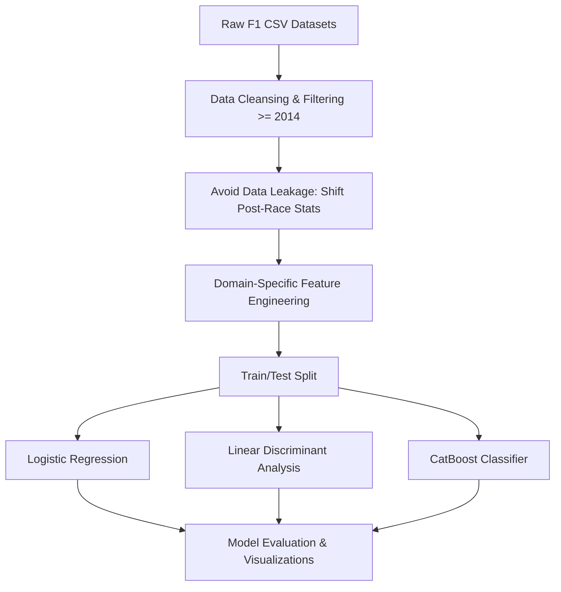
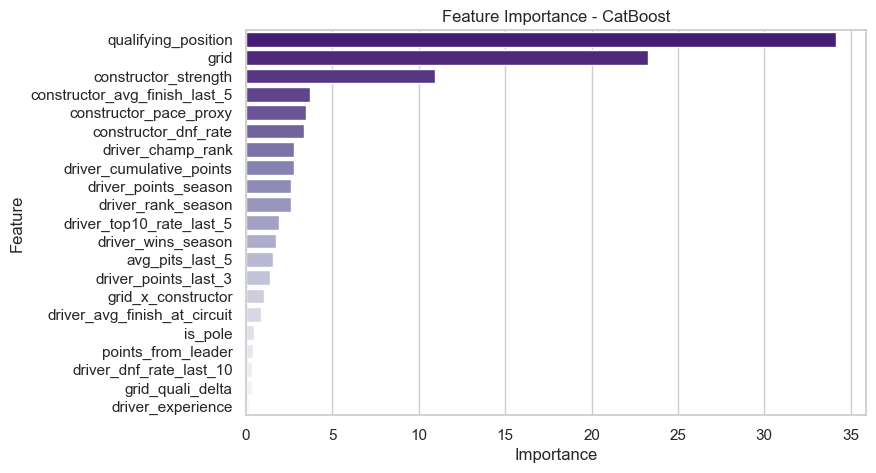
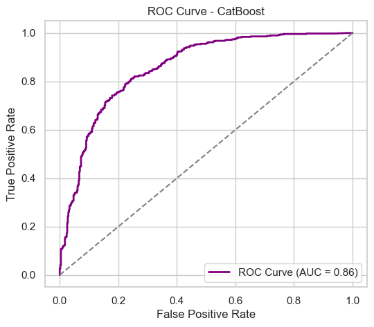
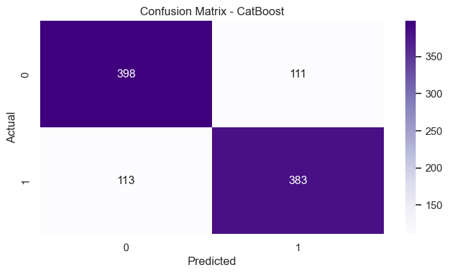
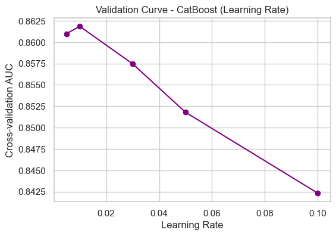
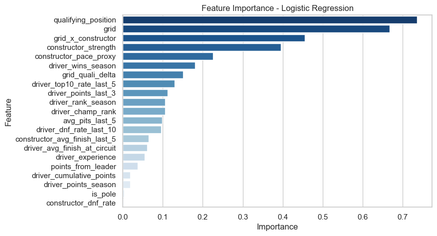
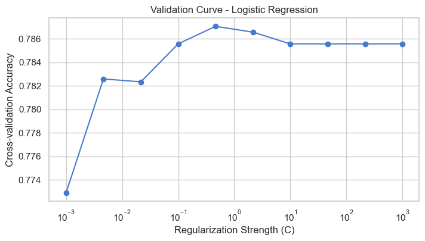

# 🏎️ Formula 1 Race Outcome Predictor (Top-10 Finish)

[](https://www.python.org/)
[](https://pandas.pydata.org/)
[](https://scikit-learn.org/)
[](https://catboost.ai/)
[](https://jupyter.org/)

An end-to-end Machine Learning project that predicts whether a Formula 1 driver will finish in the **Top 10 (points-paying positions)** for any given Grand Prix. 

Built using modern F1 hybrid era data (2014–Present), this project showcases advanced data pipeline engineering, domain-specific feature engineering (preventing data leakage), and classification modeling with **Logistic Regression**, **Linear Discriminant Analysis (LDA)**, and **CatBoost**.

---

## 📌 Project Overview & Objective

In Formula 1, finishing in the Top 10 is the boundary between scoring championship points and leaving empty-handed. For mid-field teams, predicting this outcome is vital for race strategy, risk management, and competitive benchmarking.

The objective of this project is to build a predictive classifier that estimates a driver's probability of finishing in the **Top 10** using **only pre-race and qualifying information**. 



---

## 🛠️ Engineered Features (F1 Domain Knowledge)

F1 outcomes are highly dependent on track position, constructor strength, and driver form. To capture these dynamics without introducing data leakage, 16 custom features were engineered by shifting historical results to represent the state *before* the red lights go out:

*   **Grid Position & Qualifying Delta:** `is_pole` (starting P1), `grid_quali_delta` (detecting grid penalties/gearbox changes), and the interaction term `grid_x_constructor`.
*   **Driver Form & Familiarity:** `driver_top10_rate_last_5` (recent consistency), `driver_points_last_3` (recent momentum), and `driver_avg_finish_at_circuit` (track-specific mastery).
*   **Constructor Strength & Reliability:** `constructor_strength` (average points accumulated up to the current race) and `constructor_dnf_rate` (team reliability proxy).
*   **Championship Context:** `driver_champ_rank` (standing in the driver standings) and `points_from_leader` (championship margin).

### Feature Correlation with Top-10 Finish (Top Predictors)
*   **Driver Championship Rank (`driver_champ_rank`):** `-0.54` (Lower rank = better chance of top-10)
*   **Constructor Pace Proxy (`constructor_pace_proxy`):** `-0.53` (Lower historical finishing order = better chance)
*   **Constructor Average Finish (`constructor_avg_finish_last_5`):** `-0.52`
*   **Driver Top-10 Rate Last 5 (`driver_top10_rate_last_5`):** `+0.51`
*   **Constructor Strength (`constructor_strength`):** `+0.50`

---

## 📊 Modeling & Evaluation

We compared three distinct classification algorithms on our test set. The models were evaluated using **Accuracy, ROC-AUC, Confusion Matrices, and Learning Curves**.

| Model | Test Accuracy | Strengths |
| :--- | :---: | :--- |
| **Linear Discriminant Analysis (LDA)** | **78.3%** | Highly stable, excellent baseline performance |
| **Logistic Regression** | **77.6%** | Extremely interpretable, tells us exactly how much grid position matters |
| **CatBoost Classifier** | **78.0%** | Captures non-linear feature interactions (e.g., driver age vs. car reliability) |

---

## 🎨 Visualizations Gallery

All model outputs and curves are automatically generated and saved in the [visuals/](./visuals/) directory.

### 1. CatBoost Classifier Analysis
*   **Feature Importance:** Captures what factors the gradient-boosted trees rely on most.
*   **ROC Curve:** Demonstrates strong discriminative power between Top-10 finishers and non-finishers.

| Feature Importance | ROC Curve |
| :---: | :---: |
|  |  |

| Confusion Matrix | Validation Curve |
| :---: | :---: |
|  |  |

---

### 2. Logistic Regression Analysis
*   Offers a highly explainable view of feature impacts.

| Feature Importance | Validation Curve |
| :---: | :---: |
|  |  |

---

## 📂 Project Structure

```directory
├── data/
│   ├── raw/                  # Original CSV files (circuits, drivers, results, qualifying, etc.)
│   ├── merged_clean.csv       # Preprocessed and filtered dataset (2014+)
│   └── merged_extended.csv    # Final dataset with 55 engineered features
├── models/                   # Saved model binaries (optional serialization)
├── notebooks/
│   └── F1_Prediction.ipynb   # Main Jupyter notebook containing data engineering & training
├── visuals/                  # Generated plots (Confusion matrices, ROC curves, feature importances)
└── README.md                 # Project presentation
```

---

## 🚀 How to Run the Project

1.  **Clone the repository:**
    ```bash
    git clone https://github.com/<your-username>/Formula1_Prediction.git
    cd Formula1_Prediction
    ```
2.  **Install dependencies:**
    ```bash
    pip install pandas numpy scikit-learn catboost matplotlib seaborn ipykernel
    ```
3.  **Run the notebook:**
    Open `notebooks/F1_Prediction.ipynb` in your preferred editor (VS Code, Jupyter Lab) and execute the cells to run the data pipeline, train the models, and re-export the performance visuals.

---

## 🔮 Future Enhancements
*   **Weather Integration:** Merge historical live weather data (rain probability, track temperatures) to capture wet-weather masterclasses.
*   **Real-time Live Strategy API:** Extend the model to update live probabilities lap-by-lap during pit-stop windows.
*   **Deep Learning/LSTM:** Incorporate sequences of driver performance over multiple seasons to model career trajectory decay/growth.

---

